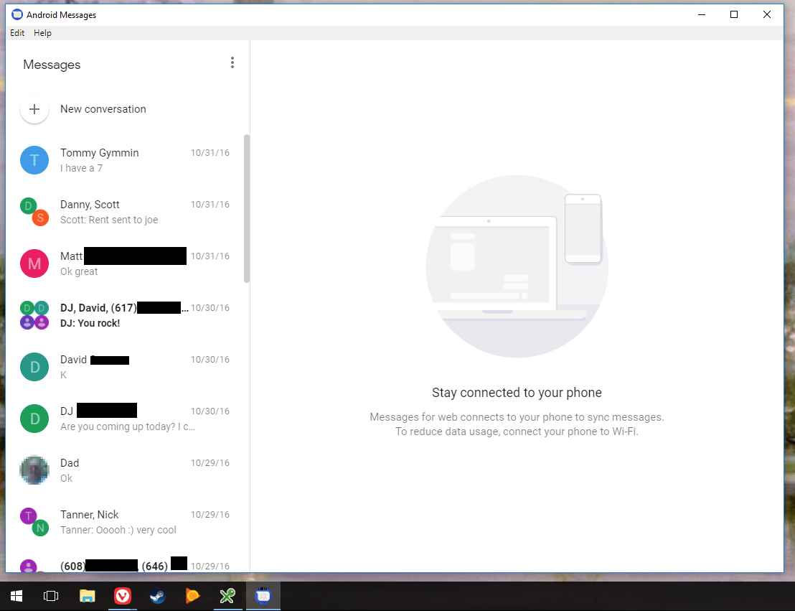
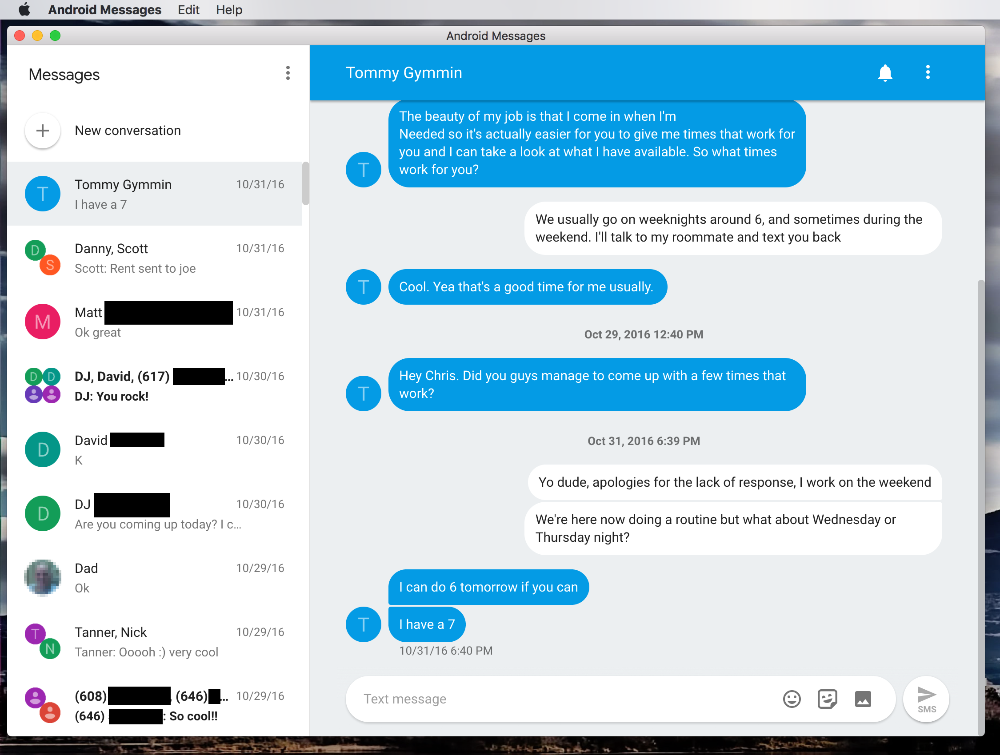
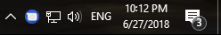
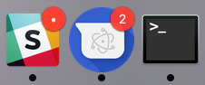

# Android Messages™ Desktop <a href="#"></a> 

Run Android Messages as a desktop app, a la iMessage. For those of us that prefer not to have a browser tab always open for this sort of thing.

**Not affiliated with Google in any way. Android is a trademark of Google LLC.**

<a href="#"></a> 
<a href="#"></a> 
<a href="#"></a> 
<a href="#"></a> 

### Disclaimer: I have tested this with my Pixel on both macOS High Sierra and Windows 10. Normal functionality seems to work, but help testing and feedback is greatly appreciated!

Inspired by:

* [Google Play Music Desktop Player](https://github.com/MarshallOfSound/Google-Play-Music-Desktop-Player-UNOFFICIAL-)
* [a Reddit post on r/Android](https://www.reddit.com/r/Android/comments/8shv6q/web_messages/e106a8r/)

Based on:

* [electron-boilerplate](https://github.com/szwacz/electron-boilerplate)

# Download
Head over to the [latest releases](https://github.com/chrisknepper/android-messages-desktop/releases/latest) page!
* For Mac, choose the **dmg**
* For Windows, choose the **exe**
* For Linux, choose either the **deb**, the **snap**, the **pacman**, or the **AppImage**

**Important note:** The Windows app binary isn't signed. This doesn't seem to be a big problem, but please report any issues you run into on Windows that may be related to signing.

**Important note 2:** We currently have builds for Windows and macOS, and Linux. I've only tested on macOS and Windows 10, and would love help testing on Linux and older versions of Windows.

# Features
* System notifications when a text comes in
* Notification badges on macOS
* Run in background on Windows / Linux / macOS
* Minimize to tray on WIndows / Linux
* Menu bar support on macOS
* TBD...

# TODOs / Roadmap (rough order of priority):
- [x] Make sure it actually works (definitely works as of v0.1.0, done via [8068ed2](../../commit/8068ed2))
- [x] Release signed binaries for macOS (binaries are signed as of v0.0.2, done via [8492023](../../commit/8492023))
- [x] Make an icon (done via [df625ba](../../commit/df625ba))
- [x] Remove left-over code from electron-boilerplate (done via [4e7638a](../../commit/4e7638a))
- [ ] Correct tests
- [x] Release packages for Linux (done via [41ed205](../../commit/41ed205))
- [x] Handling updates (done via [625bf6d](../../commit/625bf6d))
- [x] Platform-specific UX enhancements (i.e. badges in macOS dock) (this specific enhancement is in as of v0.1.0, done via [8068ed2](../../commit/8068ed2)) **UX enhancements and features are now being worked on with issues submitted by users**
- [ ] Release signed binaries for Windows
- [ ] Make a website? (if it gets popular enough)
- [ ] Support customization/custom options a la Google Play Music Desktop Player?

# Development
Make sure you have [Node.js](https://nodejs.org) installed, then run the following in your terminal:

```
git clone https://github.com/chrisknepper/android-messages-desktop.git
cd android-messages-desktop
npm install
npm start
```

## Starting the app in development mode
```
npm start
```

# Testing
Run all tests:
```
npm test
```

## Unit
```
npm run unit
```
Using [electron-mocha](https://github.com/jprichardson/electron-mocha) test runner with the [Chai](http://chaijs.com/api/assert/) assertion library. You can put your spec files wherever you want within the `src` directory, just name them with the `.spec.js` extension.

## End to end
```
npm run e2e
```
Using [Mocha](https://mochajs.org/) and [Spectron](http://electron.atom.io/spectron/). This task will run all files in `e2e` directory with `.e2e.js` extension.

# Making a release
To package your app into an installer use command:
```
npm run release
```

Once the packaging process finished, the `dist` directory will contain your distributable file.

We use [electron-builder](https://github.com/electron-userland/electron-builder) to handle the packaging process. It has a lot of [customization options](https://www.electron.build/configuration/configuration), which you can declare under `"build"` key in `package.json`.

# The icons
We use [png2icons](https://www.npmjs.com/package/png2icons) to create Windows and Mac icons from the source PNG icon, which is located in [assets/android_messages_desktop_icon.png](assets/android_messages_desktop_icon.png). However, the Windows icon generated from this package seems to result in visual corruption on Windows 10, so I'm manually converting the PNG to a Windows icon with [icoconvert.com](http://icoconvert.com) for the time being.
